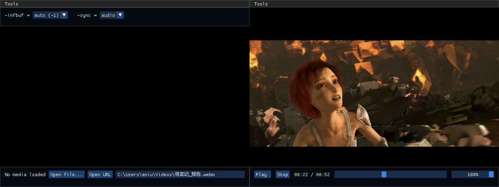

# **FFPlayer**

- [**FFPlayer**](#ffplayer)
  - [ffplay-cli](#ffplay-cli)
  - [ffplay-gui](#ffplay-gui)

## ffplay-cli

The **first phase of refactoring `ffplay.c`** by enabling standalone compilation. Currently archived. See `ffplay-cli/README.md` for more info.

## ffplay-gui

This project focuses on two:

1. Decoupling ffplay.c into **playback engine**, **rendering** and **application**;

2. Adding a UI layer (currently based on Dear ImGui).

See `ffplay-gui/README.md` for more info.