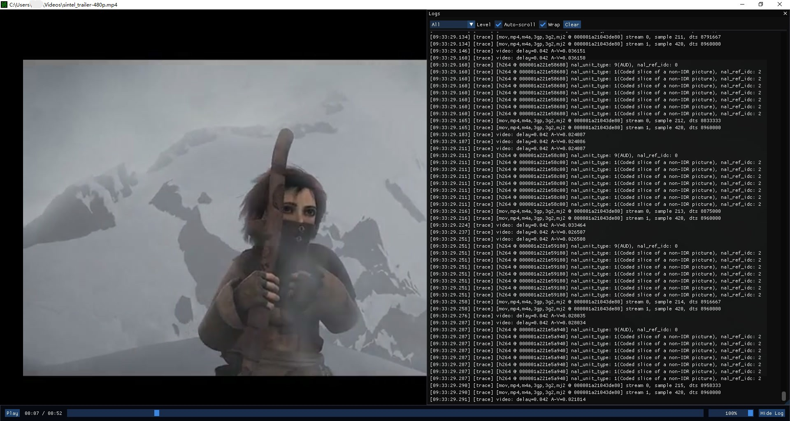

# ffplay-gui

- [ffplay-gui](#ffplay-gui)
  - [FFPlayer API](#ffplayer-api)
  - [Renderer](#renderer)
  - [Application](#application)
  - [FIXME](#fixme)
  - [TODO](#todo)

## FFPlayer API

目前将 ffplay 抽出了以下 API，主要是对 `VideoState` 和 `stream_` 函数的提取。

| 类型 | API | 描述 |
| :--- | :--- | :--- |
| **基础类型** | `FFPlayer` | 播放器实例句柄（不透明结构体） |
| | `FFPlayerShowMode` | 播放显示模式枚举（视频、波形图、RDFT） |
| **生命周期** | `ffplayer_create` | 创建并初始化播放器实例 |
| | `ffplayer_free` | 销毁播放器并释放资源 |
| **媒体控制** | `ffplayer_open` | 打开指定的媒体 URL 或文件路径 |
| | `ffplayer_close` | 关闭当前打开的媒体 |
| | `ffplayer_is_open` | 检查媒体是否处于打开状态 |
| **播放控制** | `ffplayer_toggle_pause` | 切换播放/暂停状态 |
| | `ffplayer_step_frame` | 逐帧播放（步进） |
| | `ffplayer_seek_relative` | 基于当前位置的相对跳转（秒） |
| | `ffplayer_seek_to_ratio` | 按进度条比例跳转（0.0 - 1.0） |
| **音频控制** | `ffplayer_set_volume` | 设置播放音量 |
| | `ffplayer_toggle_mute` | 切换静音状态 |
| | `ffplayer_adjust_volume_step` | 按步长调整音量 |
| **轨道切换** | `ffplayer_cycle_audio_track` | 循环切换音频流 |
| | `ffplayer_cycle_video_track` | 循环切换视频流 |
| | `ffplayer_cycle_subtitle_track` | 循环切换字幕流 |
| **信息查询** | `ffplayer_get_position` | 获取当前播放位置（秒） |
| | `ffplayer_get_duration` | 获取媒体总时长（秒） |
| | `ffplayer_get_media_title` | 获取媒体标题 |
| **渲染集成** | `ffplayer_refresh` | 刷新内部状态并计算下一次刷新的延迟时间 |
| | `ffplayer_needs_refresh` | 检查是否需要触发刷新 |
| **数据访问** | `ffplayer_get_video_frame` | 获取当前待显示的视频帧 (AVFrame) |
| | `ffplayer_get_subtitle` | 获取当前待显示的字幕 (AVSubtitle) |
| | `ffplayer_get_video_size` | 获取视频分辨率及采样宽高比 (SAR) |
| **配置与回调** | `ffplayer_set_hw_device_ctx` | 设置硬件加速解码设备上下文 |
| | `ffplayer_set_frame_size_callback` | 设置分辨率变化时的通知回调 |
| | `ffplayer_set_supported_pixel_formats` | 设置渲染器支持的像素格式列表 |

## Renderer

- 将原版的 SDL2 后端剔除，换成了 D3D11 后端。
- 支持硬解相关纹理转换。

## Application

应用层直接使用 ImGUI。

## FIXME

- 缺陷：字幕流不显示

## TODO

- 进度条偶发跳回最左端
- 异步准备（PrepareAsync）
    - 显式两阶段：例如 prepare（或 open 只做 demux + 探测，start 才真正开解码线程），或 open + start 组合，便于「先缓冲再开播」。
- 增加网络流
- 倍速
- 音频
    - 指定设备名
    - 音轨
    - 音量曲线
- 跨进程纹理输出 ?
- 多级 Seek 分流的策略
    - 进度条上的“雪碧图”（第一级：触觉响应）
    - 背景里的“影子视频”（第二级：视觉平滑）
    - 松开手后的“精准 Seek”（第三级：最终呈现）